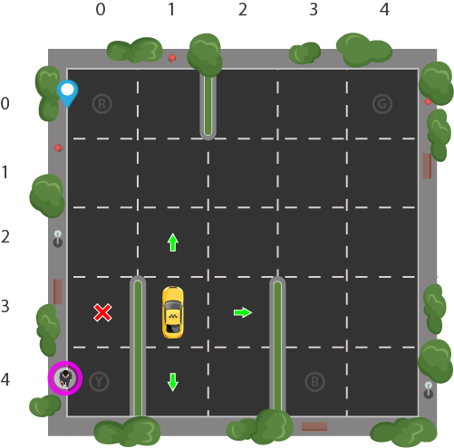

# Trajeto Dijkstra Vs Bellman-Ford

**Número da Lista**: X 
**Conteúdo da Disciplina**: Final 

## Alunos
|Matrícula | Aluno |
| -- | -- |
| 18/0096991  |  Álvaro Leles Guimaraes |
| 18/0102087  |  Ian Fillipe Pontes Ferreira |

## Sobre 
Descreva os objetivos do seu projeto e como ele funciona. 

## Screenshots

Posição inicial do táxi | Táxi pegando o passageiro | Táxi deixando o passageiro
:---------: | :------: | :-------:
 |  | 
| Dijkstra | | Bellman-Ford
|  | | 

Tabela 1: Screenshots do projeto e um gif que mostra o programa rodando

## Instalação 
**Linguagem**: Python 
**Pré-requisitos**: Para rodar o projeto é necessário ter o Python instalado na versão 3.6.8, que foi a versão utilizada, ou uma versão superior. Acesse <a href="https://www.python.org" target="_blank">aqui</a> para instalar o Python.

## Uso 
Explique como usar seu projeto caso haja algum passo a passo após o comando de execução.

## Outros 

[Figura 1: Representação do mapa](./assets/taxienv.png)

No mapa, o passageiro sempre será representado pelo cor rosa, e o destino pela cor azul. Sendo que, tanto o passageiro quanto o destino, podem estar em 4 possíveis localizações.

- Possíveis localizações do passageiro e do destino:

|Index|Letra
|:---:|:---:|
|  0 | R  |   
| 1  | G  |   
| 2  | Y  |  
| 3  | B  | 

Tabela 2: Índices que mostram as possíveis posições de origem e destino do passageiro

